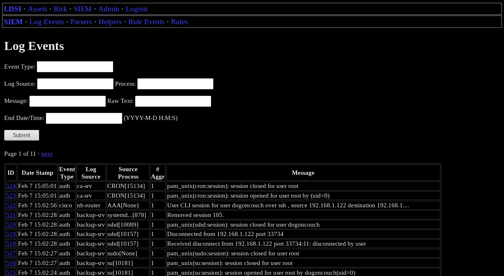
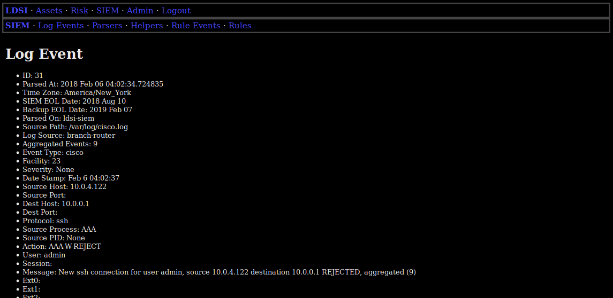
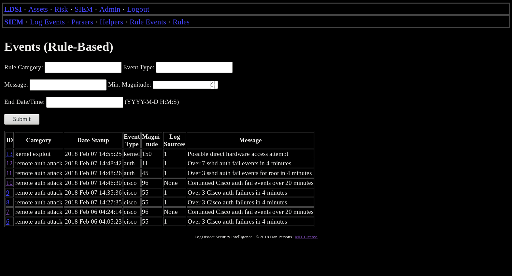
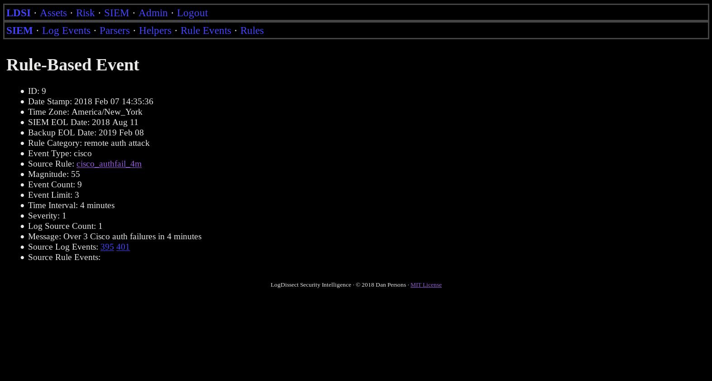
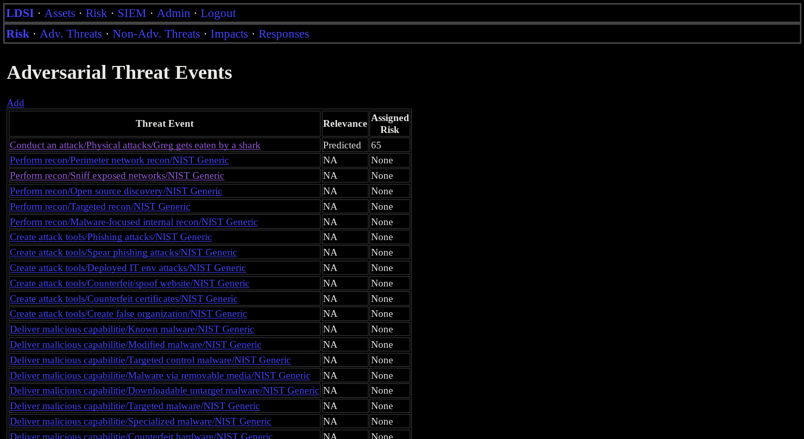

# LogDissect Security Intelligence

LogDissect Security Intelligence (c) 2018 Dan Persons | [MIT License](../LICENSE)

## Index

- [Introduction](#introduction)
- [Documentation](#documentation)
- [Installing](#installing)
- [Screenshots](#screenshots)

## Introduction
LDSI is a SIEM (Security Information and Event Management system) written in Python Django. It features a web frontend, and handles log management and forensics, risk management, and asset management.

### Design Principles
#### Security
LDSI was designed and built as a security application, and minimalism can be good for security.

- LDSI does not require credentials, or installation of its software, on log sources. Event forwarding is left entirely up to syslog daemons.
- LDSI uses no client-side scripting.

#### [NIST](https://www.nist.gov/) guidelines
The LDSI risk management system is based on NIST [risk assessment](https://csrc.nist.gov/publications/detail/sp/800-30/rev-1/final) guidelines, and the SIEM and forensics apps are designed to support the NIST [incident response](https://csrc.nist.gov/publications/detail/sp/800-61/rev-2/final) and [forensics](https://csrc.nist.gov/publications/detail/sp/800-86/final) guidelines.

#### Simplicity
LDSI embraces the Unix design philosophy. It is designed to be as simple as possible, in order to be easy to understand, use, maintain, and extend.

### Applications
LDSI includes a few different applications:
- SIEM - Security Information and Event Management
- Assets - Asset Management
- Risk - Risk Management

## Documentation
See the [documentation index](doc/index.md)

## Installing
See [Ubuntu install instructions](doc/install-ubuntu.md) for Ubuntu server installation.

Note: This installation is intended for development, and trying out the software. In production environments, LDSI should be configured by a professional with experience securing production servers.

## Screenshots

### SIEM

#### Log event search:

#### Log event detail view:

#### Rule event search:

#### Rule event detail view:

### Risk Management

#### Adversarial threat event index:

#### Adversarial threat event detail:

#### Non-adversarial threat event detail:

