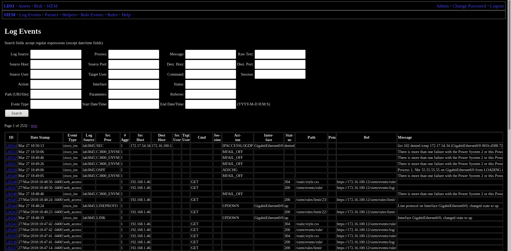
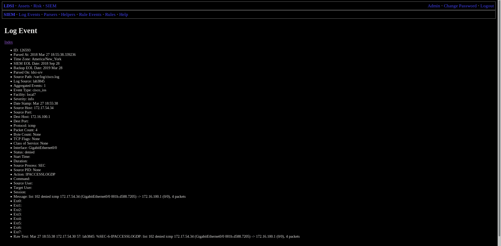
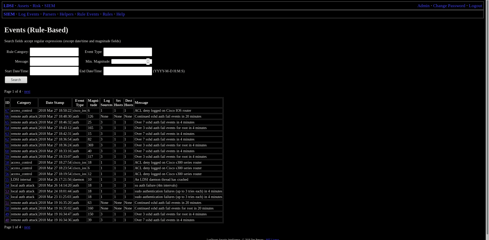
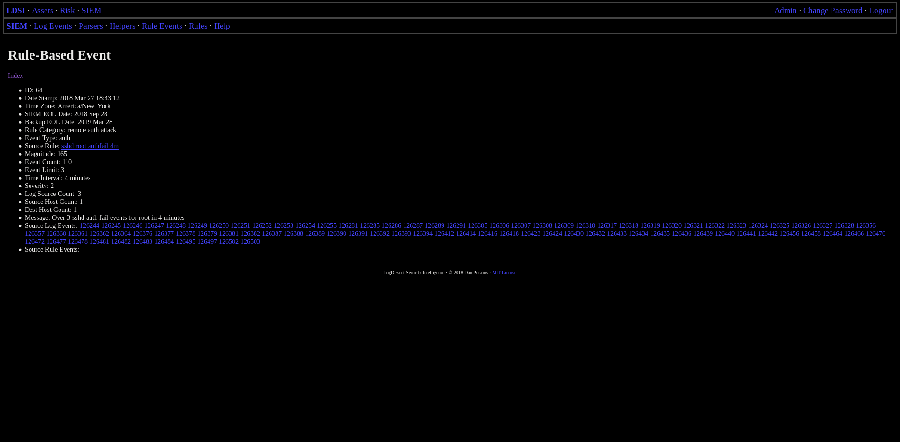
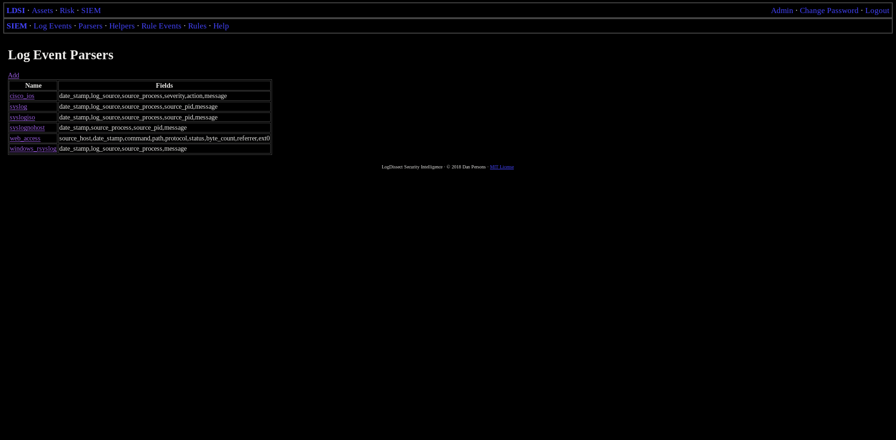
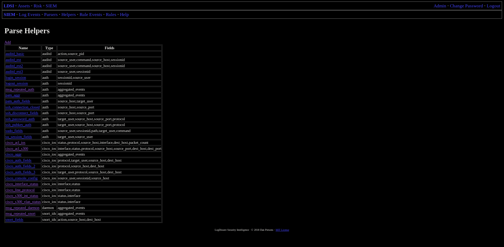
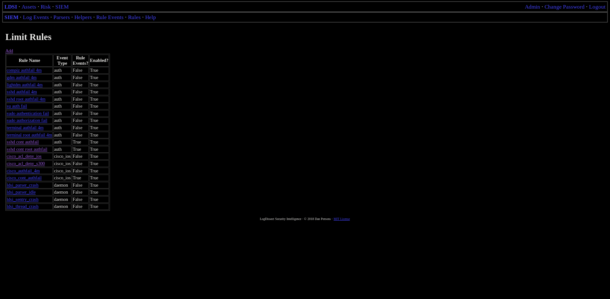
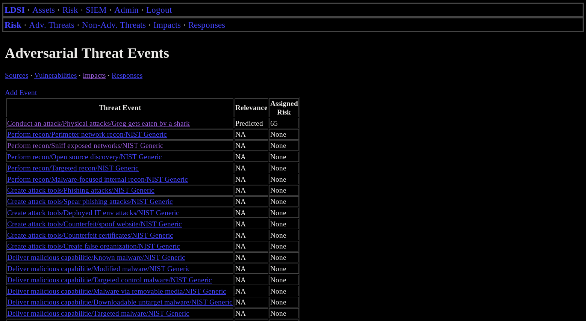
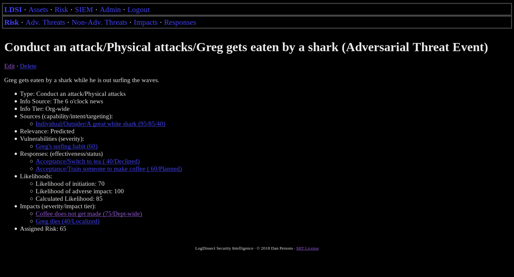
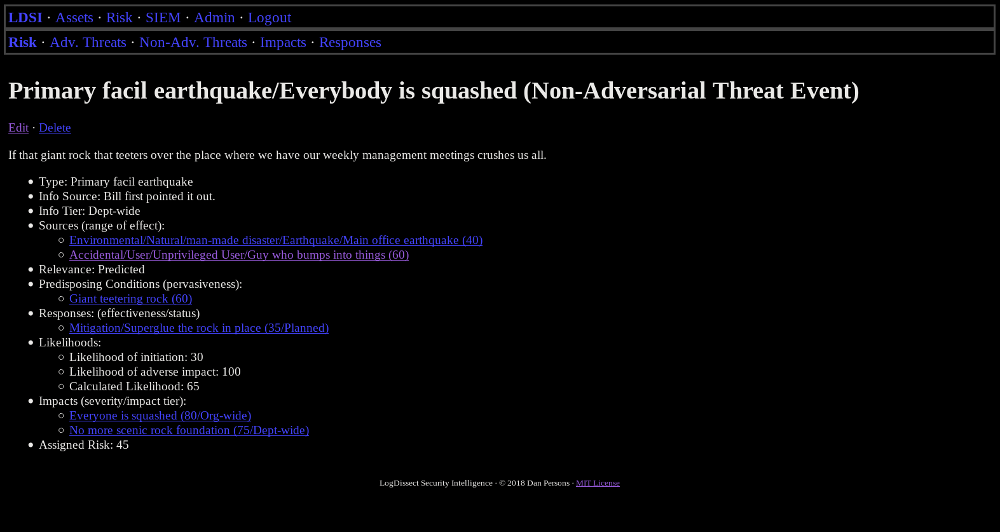

# LogESP Screenshots

LogESP (c) 2018 Dan Persons | [MIT License](../LICENSE)

## Index
- [SIEM](#siem)
- [Risk Management](#risk-management)

## SIEM

### Log Event Search:

### Log Event Detail View:

### Rule Event Search:

### Rule Event Detail View:

### Parser Index:

### Parse Helper Index:

### Limit Rule Index:

## Risk Management

### Adversarial Threat Event Index:

### Adversarial Threat Event Detail:

### Non-adversarial Threat Event Detail:

